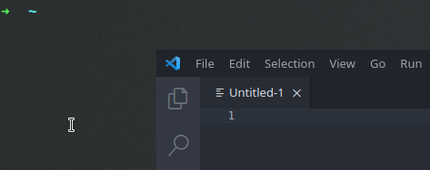

import main from "./main.png";


In this post, we will use `pass` to set up a complete, shared and segmented, professional password store.

<!--truncate-->

:::note
This post contains ideas and suggestions for a more advanced use of `pass`; it's intended for people who already know its basic usage.
:::

---

Before all, why do I use a trivial command line tool instead of one of the many fancy password managers available?

Because I believe critical things need to be kept simple.

They need to be open source and have proven themselves by being maintained, audited, and used by many.

:::info
Even a serious security company is capable of inadvertently exposing a backdoor on their users' machines [allowing remote code execution and the theft of your passwords](https://bugs.chromium.org/p/project-zero/issues/detail?id=693&redir=1) (← I really recommend the reading of this story).
:::

`pass` is [one bash script](https://git.zx2c4.com/password-store/tree/src/password-store.sh) relying on [GPG](https://gnupg.org/). Both tools are open and have been used extensively for a while.

There are some GUIs for `pass`, some browser extensions, mobile apps, etc. but choose them carefully: the more we add, the larger the [attack surface](https://github.com/IJHack/QtPass/issues/338) becomes.

I use Termux on Android, which provides `pass` in its [packages](https://github.com/termux/termux-packages). It doesn't autofill credentials, but apps and websites are good at remembering who you are these days, so I don't need to log in often.

## Retrieve a password

First, a little tweak for the retrieval of a password.

The default command — `pass -c <password-name>` — outputs the password in the clipboard and clears it after 45 seconds.

However, I have a clipboard manager that keeps everything I put in the clipboard.

To prevent passwords from being recorded, I wrote a command that outputs them in the _X selection_ instead of the clipboard. To paste them, I click the middle mouse button, instead of using Ctrl-V.

To do that, add the following in your `.zshrc` (you might have to make some modifications if you're using a different shell):

```bash
p() {
	# Insert the password into the X selection
	# (also called primary, see `man xclip`)
	pass $1 | head -n 1 | tr -d "\n" | xclip

	# Countdown
	for i in {5..1}; do
		printf "\r$i"
		sleep 1
	done

	# Clear the selection
	echo -n "" | xclip

	echo "\r✔"
}

# Associate the completer of `pass` to the command `p`, allowing
# the Tab key to be used with `p` to autocomplete the passwords names
compdef _pass p

# Note: use `p` only to retrieve an existing password,
# not with other `pass` commands (`generate`, etc.)
```

Here it is in action:

<div style={{textAlign: 'center'}}>



</div>

## Set up more than one password store

It's possible to have two completely separated password stores by creating a new command for the second one. The new command, `passpro` for instance, will use a different directory:

```bash
passpro() {
	# Set a different password store directory,
	# then run `pass` with all the arguments received by `passpro`
	PASSWORD_STORE_DIR=~/.password-store-pro pass $@
}

_passpro() {
	# Same idea for the completer
	PASSWORD_STORE_DIR=~/.password-store-pro _pass
}

# Then we associate the two
compdef _passpro passpro

# And we can have the same short command to retrieve a password:
pp() {
	PASSWORD_STORE_DIR=~/.password-store-pro p $@
}

compdef _passpro pp
```

:::tip
Having two different pass commands is my preference, but there are other ways to have multiple stores. For instance, you could make use of `.gitignore` or git submodules to have the second store inside the first one.
:::

## Share a password store

We can share a password store with many people, while still being able to fine tune who has access to what.

- We create a subfolder for each team, for instance a `devs` subfolder and a `support` subfolder:

```
~/.password-store-pro
├── devs
│   ├── databasePassword
│   ├── serverSshKey
│   └── stackCredentials
└── support
    ├── supportPlatformPassword
    └── supportEmailPassword
```

- Inside each, we put a `.gpg-id` file listing the PGP key UIDs of the persons having access to the content of this subfolder:

```
~/.password-store-pro
├── devs          ┌───────────────────────────┐
│   ├── .gpg-id → │ Alice <alice@example.com> │
│   │             │ Bob <bob@example.com>     │
│   │             └───────────────────────────┘
│   ├── databasePassword    \
│   ├── serverSshKey         > Each file is encrypted
│   └── stackCredentials    /  for Alice and Bob
└── support       ┌───────────────────────────┐
    ├── .gpg-id → │ Alice <alice@example.com> │
    │             │ Carl <carl@example.com>   │
    │             │ David <david@example.com> │
    │             └───────────────────────────┘
    ├── supportPlatformPassword   \ Each file is encrypted for
    └── supportEmailPassword      / Alice, Carl and David
```

And that's basically it.

There are a few other things to help us:

- In the root directory, a `.public-keys` folder contains the public PGP keys of all the persons having access to the store. That allows the creation of new passwords that will be decryptable by the persons/teams we want.

- The `.gpg-id` file in the root directory lists who has access to the secrets in this directory — and any subfolder which doesn't have its own `.gpg-id`. We don't use it in this example.

- Finally, the bash script `encrypt.sh` is used to display detailed information about the password store, and to reencrypt it when a new user is given access to the store. Indeed, when a new user is added, every passwords he will have access to needs to be reencrypted for his public key. This process is explain later in this article.

So here's our complete, shared and segmented, professional password store:

```
~/.password-store-pro
├── .public-keys
│   ├── alice.asc
│   ├── bob.asc
│   ├── carl.asc
│   └── david.asc
├── devs          ┌───────────────────────────┐
│   ├── .gpg-id → │ Alice <alice@example.com> │
│   │             │ Bob <bob@example.com>     │
│   │             └───────────────────────────┘
│   ├── databasePassword
│   ├── serverSshKey
│   └── stackCredentials
├── support       ┌───────────────────────────┐
│   ├── .gpg-id → │ Alice <alice@example.com> │
│   │             │ Carl <carl@example.com>   │
│   │             │ David <david@example.com> │
│   │             └───────────────────────────┘
│   ├── supportPlatformPassword
│   └── supportEmailPassword
├── .gpg-id
└── encrypt.sh
```

The content of encrypt.sh can be found [here](https://gist.github.com/Zwyx/aecea360db2c50a058a9b1f0c5287b45).

Now, let's see how to use the password store.

## Add a new password to the shared store

Now that we have the structure of our shared store, let's create a password.

- First, we import the all public keys to our keyring:

```bash
gpg --import ~/.password-store-pro/.public-keys/*.asc
```

- And we trust them — the following needs to be done for each keys:

```bash
gpg --edit-key "<key-uid>"
gpg> trust
Your decision? 5
gpg> quit
```

- Optionally, we create a new Git branch. As the password store is a Git repository, we can run Git commands on this repository with `pass git`, for instance:

```bash
passpro git checkout -b new-password
```

- Choose in which subfolder to put the new password, and generate it:

```bash
passpro generate -n devs/cloudPlatformCredentials 20
```

- Push the branch and create a pull request.

## Give access to the password store to a new user

As stated before, when a new user is added, every passwords he will have access to needs to be reencrypted for his public key.

- First, we add the user's public key to the `.public-keys` directory.

- Then, we import it to our keyring:

```bash
gpg --import .public-keys/*.asc
```

- We find its uid:

```bash
gpg --list-keys
```

For instance, the uid can be: `Elie <elie@example.com>`

- We trust the public key:

```bash
gpg --edit-key "Elie <elie@example.com>"
gpg> trust
Your decision? 5
gpg> quit
```

- We add the key's uid in the `.gpg-id` file of each subfolder the new user needs to have access to; for instance, let's say that the new user is a developer, we add the key's uid in `devs/.gpg-id`:

```bash
Alice <alice@example.com>
Bob <bob@example.com>
Elie <elie@example.com>
```

- We now reencrypt all passwords and secrets for the new user:

```bash
./encrypt.sh devs
```

This will list the persons for whom the `devs` subfolder will be encrypted, and ask you to confirm:

```bash
Password store root directory:
	'/home/user/.password-store-pro'

1 subfolders will be encrypted.

'devs' will be encrypted for:
	Alice <alice@example.com>
	Bob <bob@example.com>
	Elie <elie@example.com>

Proceed? [y/N]
```

`./encrypt.sh` can also be run without any arguments, to reencrypt the whole store. However, remember that you need access to a password in order to be able to encrypt it for a new user, as you need to decrypt it first.

:::note
Decrypting passwords stays as easy than it is with a personal password store. Note that Windows users who only need read access to the passwords can install Gpg4win - instead of a non-official version of Pass.
:::

---

I hope you enjoyed this article, have fun with Pass!
