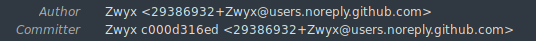

import { Image } from "@site/src/components/Image";
import gitHashMiner from "./git-hash-miner.png";

<Image
	src={gitHashMiner}
	alt="Git Hash Miner"
	legend="Git hashes mined with Git Hash Miner"
/>

Following the same principle that Bitcoin uses for its proof of work, we can "mine" our Git commit hashes too!

<!--truncate-->

---

:::note About hash mining
To be accepted in the Bitcoin blockchain, the numerical value of a block's hash needs to be lower than a certain number. This make the hash starting with some zeros. This number is regularly reduced, as computers get more powerful; the smaller the number, the harder it is to find a winning hash.
:::

We can do the same with Git commit hashes: mine them to make them start with a particular prefix. Or end with a particular suffix, or any other rule we'd like.

## How are Git commit hashes generated

Roughly, when a commit is created, Git take these details:

- the hash of the parent commit,
- the hash of the tree object,
- the author's name and email address,
- the commit creation date,
- the committer's name and email address,
- the committing date (which will different than the creation date after, for instance, an amend or a rebase),
- the PGP signature if the commit has been signed,
- the title and body of the commit,

and generates a SHA-1 hash with them. That's the commit hash.

:::tip
To "mine" a commit hash, we need to generate multiple hashes until we find one that respects our rule (for instance, starts with a particular prefix). But to make each hash different than the previous one, we need to change something in the details listed above.
:::

The package `git-hash-miner` appends a hexadecimal number to the committer name of the last commit, regenerates the SHA-1 hash of the commit details, and continues by incrementing the hexadecimal number at each round until a winning hash is found.

Once it is found, `git-hash-miner` can automatically amend the commit to add the hexadecimal number to the committer name, and let Git handle the commit and generate the SHA-1, which will be the winning one found just before.

The committer's name is usually not shown by git clients, so it's not an issue to have it modified.

And even when it's shown, by Sublime Merge for instance, I believe it's not a big deal to have the committer's name followed by a bunch of hexadecimal digits:

<div style={{ textAlign: "center" }}>



</div>

<ImageLegend>Hexadecimal number appended to the committer name</ImageLegend>

## Mine your commit hashes!

- Install `git-hash-miner`:

```bash
npm i -g git-hash-miner
```

- Then, in a Git repository, run this command after having created a commit:

```bash
gmr [--auto-amend|-a] <target>
```

where `target` is the prefix we want the commit hash to start with, and `-a` automatically amends the commit if the target is found. Do some tests without `-a` first.

Example: the command `gmr -a badc0de` will search for a commit hash starting with `badc0de` then automatically amend the previous commit once it's found.

`git-hash-miner` creates a worker for each CPU core on your machine. Roughly, you should be able to mine a hash with a prefix of up to 6 or 7 characters in a few minutes.

:::note
Note that there are other projects of this kind around the internet, some of them more performant as they use GPUs. They are, however, more complex to install than `git-hash-miner`, which is a simple Node script.
:::

:::info
Also note that at the moment, if you sign your commits, then your signature is dropped when using `git-hash-miner`.
:::

---

Have fun mining!
